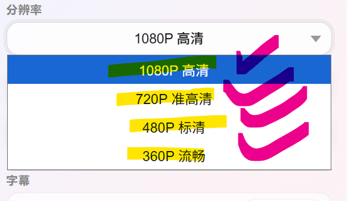
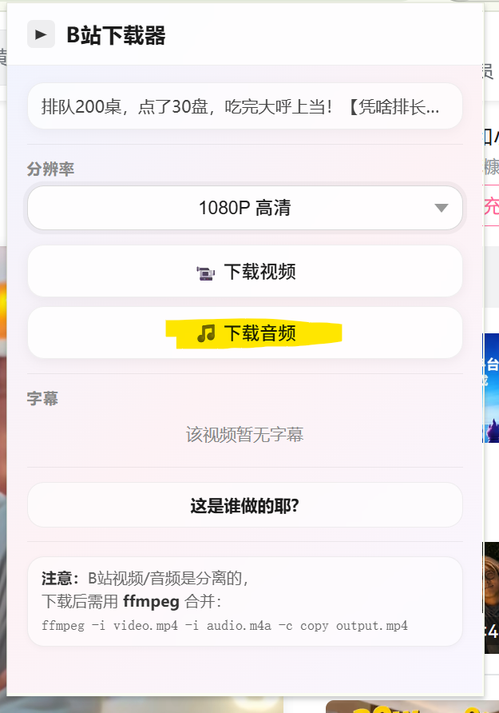
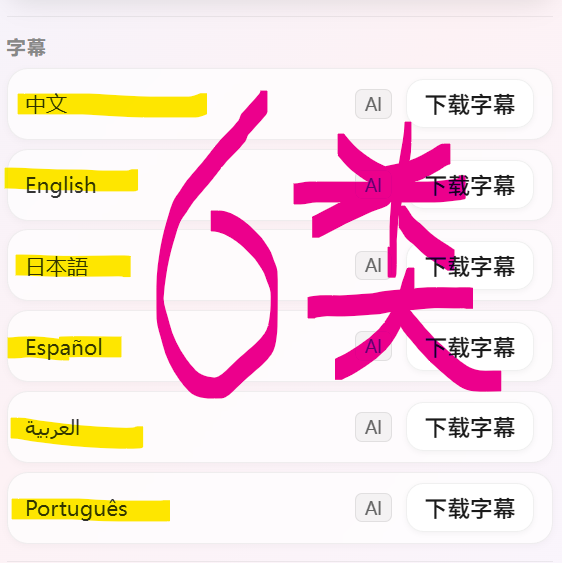
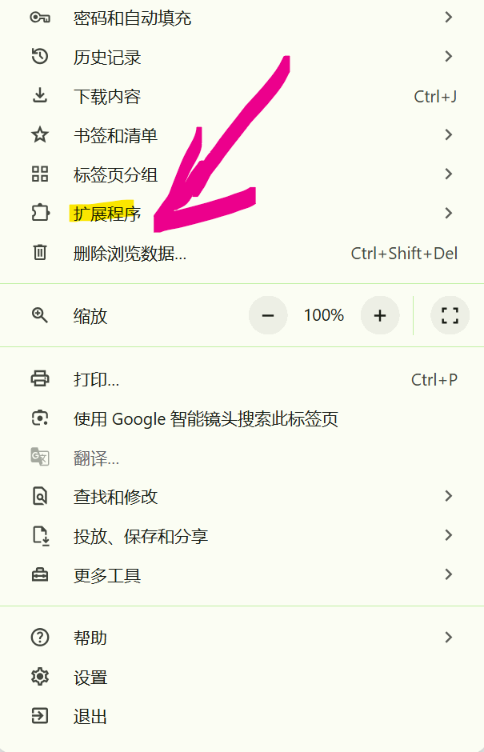
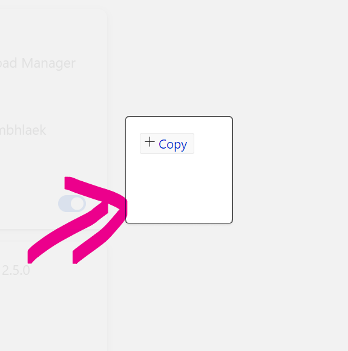
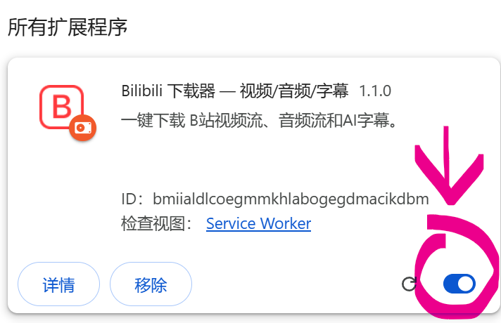
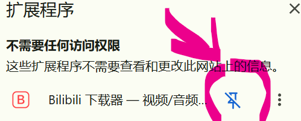
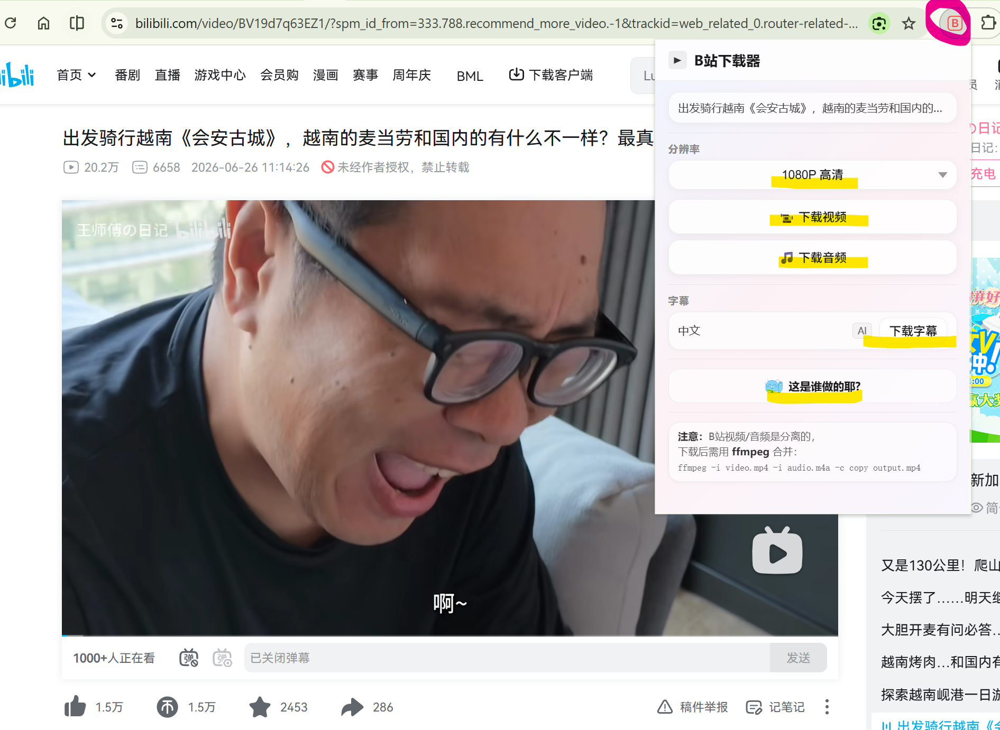

# 展示
`免费！免费！免费！`

`纯自用！`

## 支持超多分辨率：1080P 高清；720P 准高清；480P 标清；360P 流畅

## 支持音频下载

## 支持众多字幕：中文，英文，日文，西班牙语，阿拉伯语，葡萄牙语。

# 安装超级简单,就是把zip文件拖到拓展管理。
`下面是一步一步，手把手教程，不懂的人可以看`
## 点击右边的release

## 下载bilibili-dl.zip

## 点击浏览器的拓展程序

### 这是谷歌浏览器

`微软浏览器和其他浏览也是一样，不会的话可以问问AI`

## 打开右上角的开发者模式

## 将下载的bilibili-dl.zip文件**拖进**到这个页面

## 按钮打开

# 打开固定按钮

# 点击按钮就能下载啦

# 使用协议

- 本浏览器扩展不会收集、存储或上传任何个人信息，所有数据处理流程均在你的本地设备上完成。
- 本软件提供的功能仅供个人学习、研究与技术交流使用，严禁用于任何商业用途或未经授权的传播行为。
- 用户使用本软件所产生的任何版权纠纷或法律责任，由用户本人承担，软件开发者不承担任何连带责任。
- 使用即表示您已充分理解并同意遵守上述全部条款。

# 赏颗糖

如果软件确实帮助到你，欢迎打赏me，感谢支持。

